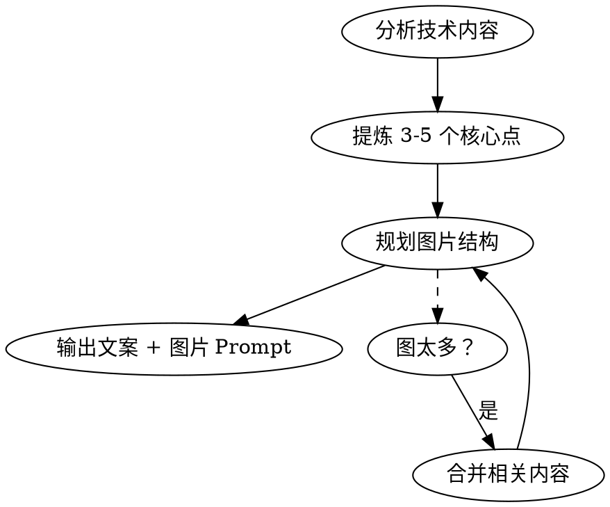

# Xiaohongshu Image Prompts

将技术内容转化为小红书知识卡片图文帖，输出可直接喂给 AI 图像生成工具（Gemini / Midjourney / DALL-E）的 prompt。

## When to Use

- 用户想把技术工作分享到小红书
- 用户提到"发小红书"、"做图"、"配图"、"知识卡片"
- 用户想把代码 / 配置 / 架构转成可视化内容

## Workflow



### Step 1: 分析内容，提炼要点

从技术内容中提取读者最关心的 3-5 个点。问自己：
- 痛点是什么？（读者为什么要看）
- 方案核心是什么？（一句话说清）
- 有什么具体数据/结果？（可信度）

### Step 2: 规划图片结构（3-5 张）

| 位置 | 作用 | 内容模式 |
|------|------|----------|
| 图1 封面 | 钩住注意力 | Before/After 对比、大标题、情感触发 |
| 图2-3 核心 | 讲清概念 | 架构图、分类表、对比、流程图 |
| 图4 收尾 | 行动指引 | 配置步骤 + 效果证明（数据/截图） |

**4 张是甜点** — 足够讲清楚，不会让人划走。超过 5 张必须砍。合并相关内容优于增加张数。

### Step 3: 输出文案

```
标题：[动词] + [核心价值] + [emoji 钩子]
例：Claude Code 终于不烦人了！一个 Hook 自动放行只读命令 🔓

正文：
[1句痛点]
[1-2句方案]
[1句结果/数据]
[行动号召 👇]

标签：#主话题 #细分领域 #使用场景 #身份标签 #平台标签
```

### Step 4: 生成图片 Prompt

每张图的 prompt **必须完整自包含**，风格前缀直接内联，用户复制即用，不需要自己拼装。

## Image Prompt 规范

### 默认风格前缀

以下前缀内联到每个 prompt 开头（用户要求其他风格时替换）：

```
Hand-drawn sketch style illustration on a clean white/light beige background.
Minimalist line art with soft pastel accent colors (light blue, coral, mint green).
The style should look like a developer's notebook doodle — casual, warm, approachable.
All text in Chinese. Layout like a Xiaohongshu knowledge card, 1080x1440px portrait orientation.
```

### Prompt 写作规则

1. **所有文字用中文** — 标题、标注、对话气泡全部中文
2. **明确描述布局** — "title at top"、"2x3 grid"、"split top/bottom"
3. **指定视觉元素** — 图标类型、连接线样式、每个区块的颜色
4. **颜色语义一致** — 绿色=安全/通过，红/珊瑚色=危险/失败，橙色=警告
5. **加入情感元素** — 简笔画人物、表情、对话气泡，增加亲和力
6. **写具体内容** — 写真实的命令名、参数，不要写占位符

### 不同图片类型的 Prompt 模式

**封面（Before/After 对比）：**
- 左侧画痛点场景（烦躁表情 + 问题画面）
- 右侧画解决后场景（开心表情 + 干净画面）
- 大箭头连接，上方大标题

**架构/分层图：**
- 从上到下或从左到右的层级结构
- 每层不同底色（淡色调）
- 每层配图标 + 关键词标签

**分类/对比图：**
- 网格布局（2x3 或 2x2）
- 每个格子不同淡色背景
- 格子内：类别名 + 3-6 个关键词

**配置/操作步骤图：**
- 带编号的步骤框
- 代码片段用手写等宽字体风格
- 底部加结果展示（数据、通过率等）

## Common Mistakes

| 错误 | 正确做法 |
|------|----------|
| 图太多（>5张） | 压缩到 3-5 张，合并相关内容 |
| 前缀没内联 | 每个 prompt 都带完整前缀，用户复制即用 |
| 纯文字堆砌 | 用图标、对比色、分区来视觉化 |
| 英文标注 | 小红书受众看中文，所有文字必须中文 |
| 内容太细 | 知识卡是导览不是教程，点到为止 |
| 风格不统一 | 所有图共享同一个风格前缀 |

## Tips

- 如果 AI 中文渲染效果差，建议只生成手绘插图，文字用 Canva/醒图后期叠加
- 用户可能要求调整张数、风格、语言 — 灵活适配，但默认 4 张 + 手绘风 + 中文
- 技术深度适可而止 — 小红书不是 GitHub README，读者要的是"这东西能帮我"
